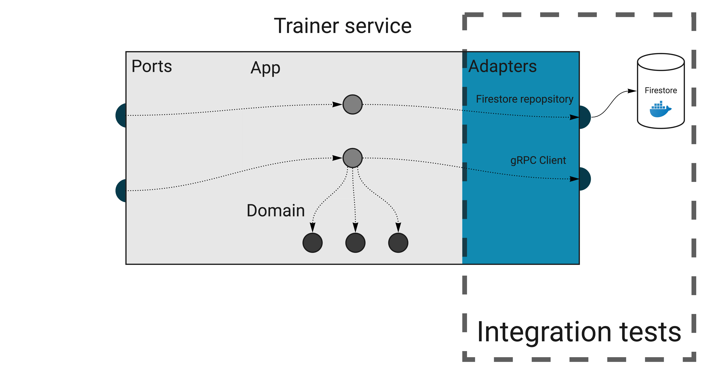

## Domain

Build a Task Management API with role-based access, enabling two types of users: Employer and Employee.

1. Employee Role:

- View Assigned Tasks: An Employee can only view the tasks assigned to them.
- Task Status Update: An Employee can update the status of their tasks (e.g., "In Progress," "Completed").

2. Employer Role:

- Create and Assign Tasks: An Employer can create tasks and assign them to specific employees.
- View All Tasks with Filtering and Sorting:
  - Filter tasks by:
    - Assignee: View tasks assigned to a specific employee.
    - Status: View tasks based on status (e.g., "Pending," "In Progress," "Completed").
  - Sort tasks by:
    - Date: Sort tasks by creation date or due date.
    - Status: Sort tasks by task status to see active or completed tasks first.
- View Employee Task Summary: An Employer can view a list of all employees, each showing:
  - Total number of tasks assigned.
  - Number of tasks completed by each employee.

## Integration tests

An integration test is a test that checks if an adapter works correctly with an external infrastructure.

These tests are not about checking whether the database works correctly, but whether you use it correctly (the integration part). It’s also an excellent way to verify if you know how to use the database internals, like handling transactions.

Because we need real infrastructure, integration tests are more challenging than unit tests to write and maintain. Usually, we can use docker-compose to spin up all dependencies.

### Keeping integration tests stable and fast

When dealing with network calls and databases, the test speed becomes super important. It’s crucial to run tests in parallel, which can be enabled in Go by calling `t.Parallel()`. **It seems simple to do, but we have to make sure our tests support this behavior.**

For example, consider this trivial test scenario:

- Check if the trainings collection is empty.
- Call repository method that adds a training.
- Check if there’s one training in the collection.

If another test uses the same collection, you will get random fails because of the race condition. Sometimes, the collection will contain more than one training we’ve just added.

The simplest way out of this is never to assert things like a list length, but check it for the exact thing we’re testing. For example, we could get all trainings, then iterate over the list to check if the expected ID is present.

Another approach is to isolate the tests somehow, so they can’t interfere with each other. For example, each test case can work within a unique user’s context (see component tests below).

of course, both patterns are more complex than a simple length assertion. When you stumble upon this issue for the first time, it may be tempting to give up and decide that “our integration tests don’t need to run in parallel”. Don’t do this. You will need to get creative sometimes, but it’s not that much effort in the end. In return, your integration tests will be stable and running as fast as unit tests.

If you find yourself creating a new database before each run, it’s another sign that you could rework tests to not interfere with each other.
